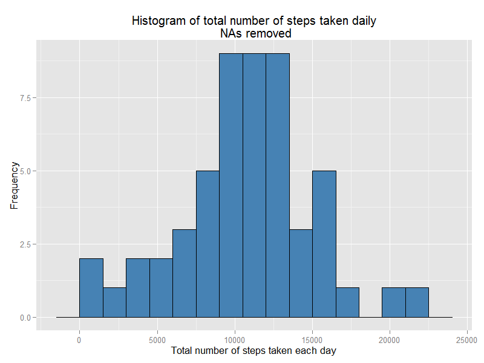
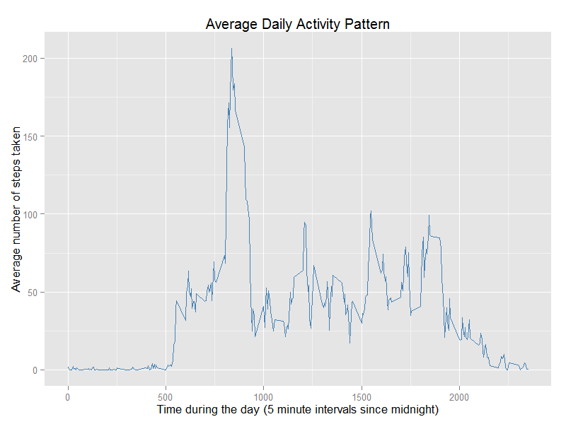
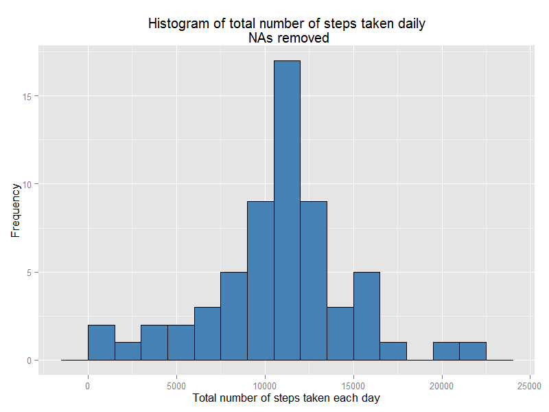
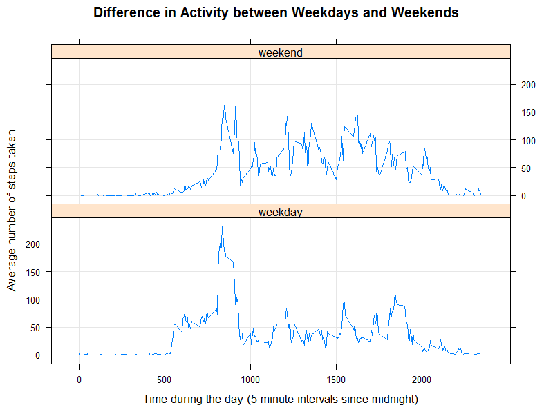

Reproducible Research: Peer Assessment 1
=============================================================================
Created by Mark K. on 11 November 2014    

# Introduction  
It is now possible to collect a large amount of data about personal movement using activity monitoring devices. Data from these devices remain under-utilized both because the raw data are hard to obtain and there is a lack of statistical methods and software for processing and interpreting the data.  

This project uses data from a personal activity monitoring device. This device collects data at 5 minute intervals through out the day. The data consists of two months of data from an anonymous individual collected during the months of October and November, 2012 and include the number of steps taken in 5 minute intervals each day.  

# Analysis  
The data are in the compressed file **activity.zip** located in the repo for this project: [my repo](https://github.com/Mark-Ko/RepData_PeerAssessment1).

## Loading and preprocessing the data
### Set options and load libraries     

```r
options(scipen = 1)  #don't print numbers in scientific notation
options(digits = 2)  #format numbers to 2 decimal digits
options(warn = -1)   #suppress warnings
library(knitr)
library(dplyr)
library(ggplot2)
library(RColorBrewer)
library(xtable)
library(lattice)
opts_chunk$set(fig.height=6, fig.width=8, dpi=100)  #global options for plots
```

### Load and preprocess data  
I assume the zip file with the data (**activity.zip**) is in the working directory.    

```r
unzip("activity.zip")
activity <- read.csv("activity.csv", header = TRUE)
# check the structure of the data frame
str(activity)
```

```
## 'data.frame':	17568 obs. of  3 variables:
##  $ steps   : int  NA NA NA NA NA NA NA NA NA NA ...
##  $ date    : Factor w/ 61 levels "2012-10-01","2012-10-02",..: 1 1 1 1 1 1 1 1 1 1 ...
##  $ interval: int  0 5 10 15 20 25 30 35 40 45 ...
```
Notice that some observations have missing data.


## What is mean total number of steps taken per day?  

Ignoring the missing data, calculate the total number of steps taken each day.  

```r
activitynoNA <- na.omit(activity) #omit NAs
# group the data by day and sum the steps for each day
activityDaynoNA <-
        activitynoNA %>%
        group_by(date) %>%
        summarize(sumNA = sum(steps))
```

### Histogram of the total number of steps taken each day  

```r
ggplot(activityDaynoNA, aes(activityDaynoNA$sumNA)) +
        geom_histogram(binwidth = 1500, color = "black",fill = "steelblue") +
        labs(x = "Total number of steps taken each day", y = "Frequency" ) +
        labs(title = "Histogram of total number of steps taken daily\n NAs removed") 
```

 

### Mean and median total number of steps taken per day  

```r
stepsMean <- mean(activityDaynoNA$sumNA)
stepsMean
```

```
## [1] 10766
```

```r
stepsMedian <- median(activityDaynoNA$sumNA)
stepsMedian
```

```
## [1] 10765
```
The **mean** number of steps taken per day is   **10766.19**.
The **median** number of steps taken per day is **10765**.

## What is the average daily activity pattern?  

### Time series plot of the 5-minute interval and the average number of steps taken, averaged across all days  

```r
# group the data by 5-minute interval and find the mean steps for each interval
dailymean <- 
        activitynoNA %>%
        group_by(interval) %>%
        summarize(mean = mean(steps))
summary(dailymean$mean)
```

```
##    Min. 1st Qu.  Median    Mean 3rd Qu.    Max. 
##       0       2      34      37      53     206
```

```r
ggplot(dailymean, aes(x = interval, y = mean, group = 1)) +
        geom_line(color = "steelblue") +
        labs(x = "Time during the day (5 minute intervals since midnight)") +
        labs(y = "Average number of steps taken") +
        labs(title = "Average Daily Activity Pattern")
```

 

### Interval containing the maximum number of steps  


```r
dailymeanMax <- max(dailymean$mean)
dailymeanMax
```

```
## [1] 206
```

```r
dailymeanMaxInt <- with(dailymean, interval[mean == max(mean)])
dailymeanMaxInt
```

```
## [1] 835
```
The 5-minute **interval** containing the maximum number of steps is **835**. The **maximum** number of steps is **206.17**. 


## Imputing missing values  

### Total number of missing values in the dataset  

```r
missSteps <- sum(is.na(activity$steps)); missSteps
```

```
## [1] 2304
```

```r
missStepspc <- 100*mean(is.na(activity$steps))
missDates <- sum(is.na(activity$date)); missDates
```

```
## [1] 0
```

```r
missInt <- sum(is.na(activity$interval)); missInt
```

```
## [1] 0
```
There are **2304** rows with missing values, 13.11% of the rows in the dataset. The variable **steps** is the only variable in the data frame with missing values.    

### Strategy for filling in missing values in the data set  

#### Check the distribution of the NAs by day in the data set.  

```r
# group the data by date and find number of NAs for each date
activityDayNA <- 
        activity %>%
        group_by(date) %>%
        summarize(NAsum = sum(is.na(steps)))
summary(activityDayNA$NAsum)
```

```
##    Min. 1st Qu.  Median    Mean 3rd Qu.    Max. 
##       0       0       0      38       0     288
```

```r
# Are there any days with more than 0 and less than 288 NAs?
with(activityDayNA, max(NAsum[NAsum>0]))
```

```
## [1] 288
```

```r
with(activityDayNA, min(NAsum[NAsum>0]))
```

```
## [1] 288
```
Since the minimum of the NAs by day equals the maximum of the NAs by day, the days with NAs must have max=min=288 NAs. **There are no days with between 1 and 287 NAs**. The number of minutes in a day is 1440. The number of 5-minute intervals in a day is 288. Therefore, the NAs are due to days missing all step values.   

#### Strategy for imputation  
My imputation strategy is quite simple. I've already calulated the mean number of steps for each 5-minute interval, **dailymean$mean**. I'll use these mean values for the days missing all steps values. This is a quick and dirty *mean imputation*.

First, find which days have the NAs.  

```r
NAdays <- with(activityDayNA, as.character(date[NAsum == 288]))
NAdays
```

```
## [1] "2012-10-01" "2012-10-08" "2012-11-01" "2012-11-04" "2012-11-09"
## [6] "2012-11-10" "2012-11-14" "2012-11-30"
```
Then just use the  mean steps from data frame **dailymean** for the eight days with NAs, **NAdays**.  

### Create a data set with missing values imputed  

```r
# join the activity and dailymean data by 5-minute interval 
imputed <- 
        left_join(activity,dailymean, by = "interval") %>%
        arrange(interval) 
# impute by using mean steps per interval for days with missing values
imputed$steps[imputed$date %in% NAdays] <- imputed$mean[imputed$date %in% NAdays]
imputed <- arrange(imputed, date)
str(imputed)
```

```
## 'data.frame':	17568 obs. of  4 variables:
##  $ interval: int  0 5 10 15 20 25 30 35 40 45 ...
##  $ steps   : num  1.717 0.3396 0.1321 0.1509 0.0755 ...
##  $ date    : Factor w/ 61 levels "2012-10-01","2012-10-02",..: 1 1 1 1 1 1 1 1 1 1 ...
##  $ mean    : num  1.717 0.3396 0.1321 0.1509 0.0755 ...
```

```r
# check that there are no more NAs
sum(is.na(imputed$steps))
```

```
## [1] 0
```

### Histogram of the total number of steps taken each day in imputed data set  
#### Determine the total number of steps taken each day  

```r
# group the imputed data by date and find number of steps for each date
imputedDay <- 
        imputed %>%
        group_by(date) %>%
        summarize(sumImp = sum(steps))
```

#### Plot the histogram  

```r
ggplot(imputedDay, aes(imputedDay$sumImp)) +
        geom_histogram(binwidth = 1500, color = "black",fill = "steelblue") +
        labs(x = "Total number of steps taken each day", y = "Frequency" ) +
        labs(title = "Histogram of total number of steps taken daily\n NAs removed")
```

 

#### Mean and median total number of steps taken per day  

```r
# set up a data frame with the means and medians in order to use xtable
compare <- matrix(c(mean(activityDaynoNA$sumNA), median(activityDaynoNA$sumNA), 
                mean(imputedDay$sumImp),median(imputedDay$sumImp)), 2, 2,
                byrow = TRUE)                                               
compare <- data.frame(compare)
rownames(compare) <- c("no NAs", "imputed")
colnames(compare) <- c("mean", "median")
print(xtable(compare), type = "html")
```

<!-- html table generated in R 3.1.1 by xtable 1.7-4 package -->
<!-- Tue Nov 11 06:59:21 2014 -->
<table border=1>
<tr> <th>  </th> <th> mean </th> <th> median </th>  </tr>
  <tr> <td align="right"> no NAs </td> <td align="right"> 10766.19 </td> <td align="right"> 10765.00 </td> </tr>
  <tr> <td align="right"> imputed </td> <td align="right"> 10766.19 </td> <td align="right"> 10766.19 </td> </tr>
   </table>

**Mean:** The mean number of steps taken is identical in the data sets without NAs and with NAs imputed. This is expected because my imputation strategy was using the mean daily steps by interval. Thus eight days, each with the mean number of daily steps, were added to the data set. This is apparent in the increased height of the central bin in the histogram of the imputed data set, which is almost twice that of the central bin in the histogram of the data set without NAs.  
**Median:** The median increased in the imputed data set, becoming the mean number of steps per day. Again, this isn't surprising since eight days with the mean number of steps were added to create the imputed data set. The median is now one of those added days.  

## Differences in activity patterns between weekdays and weekends  
### Create a factor variable to categorize weekends and weekdays  

```r
# convert the variable date to date class and use weekday on the dates
imputed$day <- weekdays(as.Date(imputed$date))
# categorize the days and convert to a factor
imputed$day <- ifelse(imputed$day %in% c("Saturday", "Sunday"), 
                      "weekend", "weekday")
imputed$day <- factor(imputed$day)
levels(imputed$day)
```

```
## [1] "weekday" "weekend"
```
  
### Panel plot containing a time series plot of the 5-minute interval and the average number of steps taken, averaged across all weekday days or weekend days  


```r
# group the imputed data by date and interval and find the mean steps
imputedmean <- 
        imputed %>%
        group_by(day, interval) %>%
        summarize(meanWk = mean(steps))
```


```r
xyplot(meanWk ~ interval | day, data = imputedmean, layout= c(1,2),
       type = c("l", "g"), 
       main = "Difference in Activity between Weekdays and Weekends",
       xlab = "Time during the day (5 minute intervals since midnight)",
       ylab = "Average number of steps taken")
```

 
